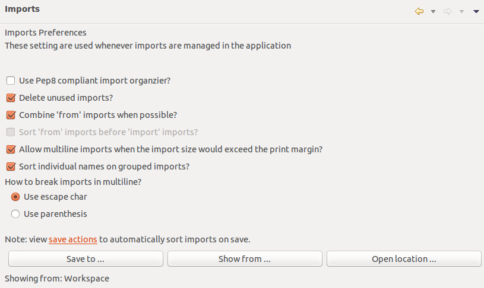
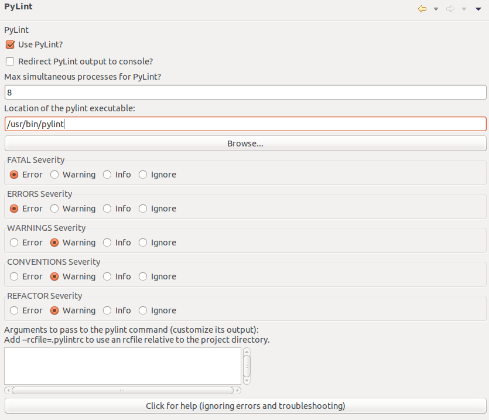

============
Coding style
============

This section provides the overview for the coding conventions used in this
project. In case of doubt, please :doc:`support_contact` the main developers.

Code format checker
-------------------

We use *pylint* and *pycodestyle* as our code checkers. These tools plus the
auto-format-on-save feature included in Eclipse will keep the code style of
the project. Below there are the parameters used to configure these
tools correctly. The goal is to have zero errors and warnings, and also
comply with all the conventions suggested by these tools.

.. note::

   **Please ensure that your patch, modification or proposal does not trigger
   any error or warning.**

We provide the following helper scripts to check the code style of the
project files::

  > ./dev_tools/ci/code_conventions_001_pycodestyle.sh
  > ./dev_tools/ci/code_conventions_002_pylint.sh
  > ./dev_tools/ci/code_conventions_003_documentation.sh

You can run them locally and fix any errors reported before committing
changes to the repository.

.. note::

   You can use ``git diff --check`` command to check for unwanted trailing
   spaces in the code base.

Pylint
^^^^^^

By default, we are not going to use any special parameter.
`Pylint <http://www.logilab.org/857>`_ default options are ensuring the
standard. Any warning issues should be treated as an error, and should be
fixed *before* committing the file to the repository.

We agree that sometimes the default options of *Pylint* are very strict, 
in such case, a bug should be reported and after the discussion, we will
relax the option or not depending on what we agree.

Pycodestyle
^^^^^^^^^^^

We also use `pycodestyle <https://pypi.python.org/pypi/pycodestyle>`_ to
verify that the code written follows the python style guide.

Eclipse formating rules
^^^^^^^^^^^^^^^^^^^^^^^

In case you use the *pydev* extension of eclipse IDE to develop Microprobe,
you can find below screenshots of the formatting configurations used so that it
is more easy to follow the conventions and avoid pylint/pycodestyle errors.

   Code style tab

   Block comments tab

.. figure:: images/code_style_3.png
   :alt: Code formatter tab
   :width: 90 %
   :figwidth: 90 %
   :align: center

   Code formatter tab

   Docstrings tab

   Imports tab

   Typing tab

   Tabs tab

   Save actions tab

   Code analysis unused tab

   Code analysis undefined tab

   Code analysis imports tab

   Code analysis others tab

   Code analysis pep8 tab

   Pylint tab

Templates
---------

Use the following template for all the **python** files included
in Microprobe, and then modify the required fields as needed and declare
the imports, functions, classes and constants accordingly.

The order of declaration within a block should be alphabetical.

.. code-block:: python

   # Copyright [YEAR] IBM Corporation 
   # 
   # Licensed under the Apache License, Version 2.0 (the "License");
   # you may not use this file except in compliance with the License.
   # You may obtain a copy of the License at
   #
   #    http://www.apache.org/licenses/LICENSE-2.0
   #
   # Unless required by applicable law or agreed to in writing, software
   # distributed under the License is distributed on an "AS IS" BASIS,
   # WITHOUT WARRANTIES OR CONDITIONS OF ANY KIND, either express or implied.
   # See the License for the specific language governing permissions and
   # limitations under the License.

   """<your one-liner module description>.

   <your module documentation here>.
   """

   # Futures

   # Built-in modules

   # Third party modules

   # Own modules

   __author__ = "<YOUR_NAME>"
   __copyright__ = "Copyright <YEAR> IBM Corporation"
   __credits__ = []
   __license__ = "Apache License, Version 2.0"
   __version__ = "<CURRENT_VERSION>"
   __maintainer__ = "<YOUR_NAME>"
   __email__ = "<YOUR_EMAIL>"
   __status__ = "Development"  # "Prototype", "Development", or "Production"

   # Constants
   __all__ = ["<your exported list of symbols>"]

   # Functions

   # Classes

For the **YAML** target definition files, please use the following template
(update the fields accordingly):

.. code-block:: yaml

   # Copyright [YEAR] IBM Corporation 
   # 
   # Licensed under the Apache License, Version 2.0 (the "License");
   # you may not use this file except in compliance with the License.
   # You may obtain a copy of the License at
   #
   #    http://www.apache.org/licenses/LICENSE-2.0
   #
   # Unless required by applicable law or agreed to in writing, software
   # distributed under the License is distributed on an "AS IS" BASIS,
   # WITHOUT WARRANTIES OR CONDITIONS OF ANY KIND, either express or implied.
   # See the License for the specific language governing permissions and
   # limitations under the License.
   #
   # Author: <YOUR_NAME>
   # Email: <YOUR_EMAIL>
   #
   # Version: <CURRENT_VERSION>
   #

   <your YAML definitions>

Coding conventions
^^^^^^^^^^^^^^^^^^

Follow the rules below when coding. You should apply them within each of the
sections the template defines (i.e. do not mix code sections):

- Do not import multiple modules in one statement, split for readability.
- ``import ...`` go before ``from ... import ...`` statements.
- ``import ...`` statements should be sorted alphabetically.
- ``from ...`` statements should be sorted alphabetically.
- ``from ...`` statements that import more than one element from the package should
  have the elements sorted alphabetically.
- Constants should be sorted alphabetically, private constants (starting with
  ``__`` and ``_``) go after the others.
- Always define the ``__all__`` special variable to define which elements are
  public (exported).
- Functions should be sorted alphabetically, but public functions go before
  private ones (starting with ``_``).
- Classes should be sorted alphabetically, but public ones go before
  private ones (starting with ``_``).
- Methods within classes should be arranged in the following manner. First the
  ``__init__`` method, then public attributes sorted alphabetically, then
  public methods sorted alphabetically, then private attributes sorted
  alphabetically and finally private methods sorted alphabetically and
  at the end all the magic methods starting with ``__`` (e.g. ``__str__``,
  ``__add__``, etc.).
- Functions and methods with named parameters should have the named parameters
  sorted alphabetically. Positional parameters only have to be sorted
  alphabetically if they are in equal importance and if the
  readability of the code is not affected.

Docstring format conventions
----------------------------

We use sphinx to auto-document the project. Please use the following
conventions when including python docstrings in the code. At the end of this
section there is a list of some useful links to more details about the
documenting formats.

Documenting modules and packages
^^^^^^^^^^^^^^^^^^^^^^^^^^^^^^^^

At the top of the module, just below the license headers explained in `Templates`_, but
above the ``# Futures`` comment, include a description of the
module. The description should include a *short* sentence with a brief
description in the first line, then a line-break and then the long description.
The short description will be used for table summaries when executing sphinx.
The following code snippet shows an example:

.. code-block:: python

   """:mod:`test` module. Example module.

   The :mod:`test` is used as example module to show how to document
   modules. All sentences in the documentation should finish with a dot.
   """

   # Futures

Documenting variables
^^^^^^^^^^^^^^^^^^^^^

Module/Package public variables should be documented. One should provide
a description just above the declaration of the variable. Each line of this
description should use ``#:`` marker in order to be considered as the
documentation string by sphinx. The description should be: a sentence 
describing the variable and its purpose, followed by a description of 
the type of the variable within parentheses. The following code snippet 
shows an example:

.. code-block:: python

   #: Dictionary mapping the name of the registered architectures to the
   #: module and the object representing them. (:class:`dict` mapping :func:`str`
   #: to :class:`tuple` of two elements. The first one is a :class:`module` and
   #: the second a :class:`~.Target`)
   REGISTERED_ARCHITECTURES = {}

Documenting classes and methods
^^^^^^^^^^^^^^^^^^^^^^^^^^^^^^^

Methods and classes are documented in a similar fashion. In general,
documenting a class (putting the docstring just below the ``class ClassName``
statement), is the same as documenting the ``__init__`` method of the class.
Our convention is to document the class (just below the ``class ClassName``
statement) with the high level description of the class and use the docstring
of the ``__init__`` method to describe the signature (parameter, return values
and possible exceptions). 

The structure of the docstring should be the following:

* A short description, a line break, a paragraph with the explanation of the
  class or method, a line break, the list of parameter definitions,
  the return type and the list of possible raising exceptions.
* There is no need to refer to types in the description unless it facilitates
  the readability of the documentation.
* The signature description should provide the type of the inputs, outputs and
  the exceptions. If containers/iterables types are used, one should specify
  the type of the contents (e.g. not only dictionary, also the type of the
  key and the values expected).
* If the parameter names are referenced in the description, they should be
  highlighted (e.g. *param*).
* Unless otherwise stated, whenever we refer to a type, we are implicitly
  referring to an instance object of that type. Therefore, for referring to
  the *class* type, we should explicitly state that.

The following code snippet shows an example. Notice that for each parameter
we always define it in two lines: the ``:param``, and the ``:type:``.

.. code-block:: python

   class Architecture(object):
      """Abstract class to represent an architecture.

      Object to represent an architecture bla bla ... It does several
      things, some of them are very interesting others are not. Please do not
      explain implementation details here, only functionality details.
      """

      def __init__(self, archdef, rregs, stress_map=None):
           """Create an Architecture object.

           :param definition: Architecture definition
           :type definition: :class:`~.ArchitectureDefinition` instance
           :param rregs: Architecture reserved registers. These registers will
                         not be used unless manually allowed
           :type rregs: :class:`dict` mapping strings to
                        :class:`~.Register` instances
           :param stress_map: Map between components and instructions that
                              stress them
           :type stress_map: :class:`dict` mapping :class:`~.ArchComponent`
                             instances to :func:`list` of
                             :class:`~.InstructionType` instances
           :return: A new architecture object
           :rtype: :class:`Architecture`
           """
           self._def = archdef
           self._rregs = rregs
           ...

       ...
       ...

       @abc.abstractmethod
       def load_var_address(self, register, var):
           """Load the address of a variable into a register.

           Return a list of instruction that sets the contents of
           *register* to the address of the *var*.

           :param register: Register
           :type register: :class:`~.Register`
           :param var: Variable object
           :type var: :class:`~.Variable`
           :return: A list of the new instruction required to load the
                    variable address
           :rtype: :func:`list` of :class:`~.Instruction`
           :raise InvalidRegisterTypeError: if the
                  register can not be used to store a variable address
           :raise OtherException: if something else happens
           """
           raise NotImplementedError

Documenting class properties
^^^^^^^^^^^^^^^^^^^^^^^^^^^^

Class properties are documented in a similar fashion than the module/package
variables: a sentence plus the type within parentheses. The following code
snippet shows an example:

.. code-block:: python

   @property
   def isa(self):
       """Instruction set architecture (:class:`dict` mapping strings to :class:`~.InstructionType`)."""
       return self._isa

Documenting private methods/properties/variables
^^^^^^^^^^^^^^^^^^^^^^^^^^^^^^^^^^^^^^^^^^^^^^^^

It is always recommended to document everything, please follow the same rules
we pointed out for public methods.

Referring to other classes/methods/properties/modules
^^^^^^^^^^^^^^^^^^^^^^^^^^^^^^^^^^^^^^^^^^^^^^^^^^^^^

As you already noticed, whenever we refer to another object --even an object
of another project-- , we always use the sphinx conventions to refer to it.
This will generate automatically the links between documentations. Check the
examples or the code base to see how to refer to other object types.

Comments and TODOs
^^^^^^^^^^^^^^^^^^

If you need to add some extra comments, such as specific implementation
details, or missing functionalities, you can add the ``.. todo::`` and
``.. note::`` entries at the end of the docstring you are documenting.

Examples
--------

We are in the process of modifying the code base to follow the conventions
defined in this section. This is a slow and tedious process that is going on
in back-ground. However, we have re-factorized the most of the 
following sections:

- :mod:`microprobe.target`
- :class:`microprobe.target.Definition`
- :class:`microprobe.target.Target`

Take a look at the source code to check the conventions used, in case of
doubts, please :doc:`support_contact` the main developers.

Useful links
------------

- `rst features <http://docutils.sourceforge.net/docs/user/rst/quickref.html>`_
- `docstring format <http://www.python.org/dev/peps/pep-0257/>`_
- `Sphinx examples <http://packages.python.org/an_example_pypi_project/sphinx.html>`_
- `Sphinx docstring format <http://sphinx.pocoo.org/markup/desc.html>`_
