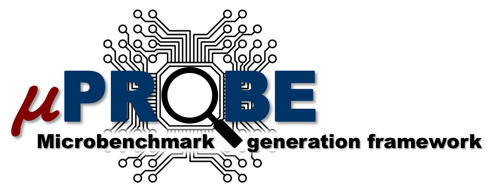

===================================
Welcome to Microprobe Documentation
===================================

Microprobe is a **productive** microbenchmark generation framework that an user 
can **adapt** towards exercising a complex multi-core, multi-threaded computing
system in a variety of redundant ways for answering a range of questions 
related to energy and performance. 

The growth in complexity of microprocessor systems today --composed of 
multi-core, multi-threaded processors with multi-level cache hierarchies and 
giga-bytes of memory--, hardens the pre-silicon system modeling and the 
post-silicon system characterizations. We believe that microbenchmarks, 
generated with particular objectives in mind, hold the key to obtaining 
accurate characterizations of microprocessor systems. Specially crafted 
microbenchmarks may be run on simulators (pre-silicon stage) or real machines 
(post-silicon stage) to help understand, diagnose and fix deficiencies 
systematically. However, manual generation of such "stress-marks" is tedious, 
and requires intimate knowledge of the underlying microarchitecture pipeline 
semantics. Automated microbenchmark generation is therefore crucial in this 
regard. Microprobe is developed to fulfill that need.

Learn more in the rest of the documentation. 

------------
Publications
------------

If you use Microprobe in your research and development, we would appreciate a 
citation to the following paper in any publications you produce.

* Ramon Bertran, Alper Buyuktosunoglu, Meeta S. Gupta, Marc Gonzalez, and Pradip
  Bose. 2012. *Systematic Energy Characterization of CMP/SMT Processor Systems
  via Automated Micro-Benchmarks*. In Proceedings of the 2012 45th Annual
  IEEE/ACM International Symposium on Microarchitecture (MICRO '12). IEEE
  Computer Society, Washington, DC, USA, 199-211. `DOI=10.1109/MICRO.2012.27
  <http://dx.doi.org/10.1109/MICRO.2012.2>`_

A list of :doc:`index_publications` using the Microprobe generator framework 
or microbenchmarks generated by Microprobe is also available. 
Please let us know if you publish a paper using Microprobe and we'll update
the list.

=============
Documentation
=============

.. toctree::
   :maxdepth: 2

   index_microprobe
   start
   tools
   tutorial
   examples
   design
   support
   devel
   index_publications
   copyright
   license
   api
