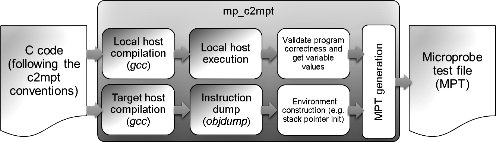

==============
Tool: mp_c2mpt
==============

--------
Overview
--------

C to MicroprobeTest (mpt) tool provides a command-line interface (CLI)
to generate MPT files (:doc:`tools_mpt_format`) from C source code by following
certain guidelines (:doc:`tools_ctest_format`). 
Then, from the MPT format, the user can use existing tools (:doc:`tools`) to 
produce test cases for different environments and formats .

.. note::

   This tool relies on third-party tools (compilers and object code 
   inspectors). The microbenchmark generation policy implemented in this tool 
   reproduces exactly the code provided by the compiler and the object code 
   inspector. The framework resolves any symbolic references (references to 
   data, or branch targets) and adds necessary code to initialize the required 
   registers so that it does not break the target Application Binary Interface.

-----------
Basic usage
-----------

::

   > mp_objdump2mpt -T TARGET -i OBJDUMP_FILE -O MPT_OUTPUT_FILE

where:

=============================================================== =================================================================
Flag/Argument                                                   Description
=============================================================== =================================================================
``-T TARGET``, ``--target TARGET``                              Target definition string. Check: :doc:`tools_target_definition`
``-i INPUT_C_FILE``, ``--input-c-file INPUT_C_FILE``            C test file following the format in :doc:`tools_ctest_format`
``-O MPT_OUTPUT_FILE``, ``--mpt-output-file MPT_OUTPUT_FILE``   Output file name
=============================================================== =================================================================

--------------
Tool work-flow
--------------

The figure below summarizes the high-level work-flow of the C to MPT command
line tool:

                
   C to MPT high level work-flow

From a given C file that complies with the :doc:`tools_ctest_format`, the 
process is two-fold (see top and bottom flows in the figure).

#. The C file is compiled using the local host compiler and executed in the 
   local host. This process is necessary to obtain the variable values at 
   run-time just before the test main function **c2mpt_function** (check 
   :doc:`tools_ctest_format`) . Also, the host execution with an exit code 
   of 0 confirms the correctness of the code that is provided.

#. The C file is compiled using the target host compiler (which can be the 
   same as the local) and then the generated instructions are obtained. The 
   instruction sequence is extended to add the necessary initialization to 
   ensure a correct execution of the code. We call this process as *environment* 
   *construction* in the figure. For instance, the stack is defined and the 
   stack pointer is initialized.

Finally, all the information (instructions, variables and their contents) is 
dumped into a MPT file which can then be used to generate test cases in 
different formats.  

The user can control some features of this work-flow using the following 
flags:

================================================== ======================================================
Flag/Argument                                      Description
================================================== ======================================================
--no-data-initialization                           Do not run the compiled code locally to get the
                                                   contents of registered variables before executing the
                                                   *c2mpt_function*. Only statically specified variable
                                                   contents will be dumped in the MPT generated
``--save-temps``                                   Store the generated intermediate files permanently;
                                                   place them in the input source file directory and name
                                                   them based on the source file
================================================== ======================================================

.. note::
   
   It is up to the user to control the compiler behavior in order to generate
   a valid test case. For instance, the compiler might consider a function to 
   be useless and therefore, remove it from the generated code. 

-------------
C test format
-------------

The input file has to be compliant with the C test case format in order to
ensure the generation of a correct test case.  Check the section 
:doc:`tools_ctest_format` for details. For your convenience, the tool provides 
a flag to dump an empty C file template, which you can use to start the
specification of the C-based test:  

================================================== ======================================================
Flag/Argument                                                   Description
================================================== ======================================================
``--dump-c2mpt-template``                          Dump a template C file, which can be used afterwards
                                                   as an input file
================================================== ======================================================

------------------------------
Third-party tool customization
------------------------------

As explained in the previous section, this tool relies on third-party tools
to generate the final MPT. Three external tools are required: a local host 
compiler, a target host compiler and the objdump utility. By default, **cc**
and **objdump** commands are assumed, but in case that the user needs to 
customize these commands, a set of customization flags are provided:

====================================================== ======================================================
Flag/Argument                                          Description
====================================================== ======================================================
``--host-c-compiler HOST_C_COMPILER``                  Local C compiler (Default:'cc')
``--host-c-compiler-flags HOST_C_COMPILER_FLAGS``      Local C compiler flags (Default:'-Wall -Werror -m64
                                                       -O3 -Wpedantic -pedantic -pedantic-errors -std=c99')
``--target-c-compiler TARGET_C_COMPILER``              Target C compiler (Default:'cc')
``--target-objdump TARGET_OBJDUMP``                    Target objdump utility (Default:'objdump')
``--target-c-compiler-flags TARGET_C_COMPILER_FLAGS``  Target C compiler flags (Default:'-Wall -Werror -m64
                                                       -O3 -Wpedantic -pedantic -pedantic-errors -std=c99')
====================================================== ======================================================

.. note:: 

   Only GNU GCC tool-chains (gcc, objdump) are currently supported. 
   
---------------------------------------------------
Customizing Application Binary Interface parameters
---------------------------------------------------

The ABI (Application Binary Interface) for a given environment (defined in 
`Linux Foundation - Referenced Specifications <http://refspecs.linuxbase.org/>`_  ) 
specifies the semantics of registers and the calling conventions. 
For instance, usually a register is 
reserved to point to the stack. So, the code being extracted from the 
objdump output requires that certain registers contain appropriate values. This 
tool supports the automatic definition of the stack, the automatic 
initialization of the stack pointer and the definition of the start symbol. 

In case the default values are not appropriate, the user can use the following 
flags to change the different options:

================================= ======================================================
Flag/Argument                     Description
================================= ======================================================
``--stack-size STACK_SIZE``       Stack size in bytes (default: 4096)
``--stack-name STACK_NAME``       Stack name (Default: microprobe_stack)
``--stack-address STACK_ADDRESS`` Stack address (Default: allocated in the data area)
``--end-branch-to-itself``        End the code with a branch to itself instruction
================================= ======================================================

.. note::

   The necessary instructions required for initializing the stack pointer
   will be added at the beginning of the code (on lower addresses) and the
   start code address will be modified accordingly.
   
-------------------
Current limitations
-------------------

- Code constraints: Do not call library functions in any of the functions to 
  be included in the final MPT. Notice that this restriction does not affect 
  the initialization functions that are not included in the MPT.
- Variable initialization constraints: As explained in previous section, the 
  program is executed locally to obtain the variable values. As a consequence, 
  in the case that the variable type is not a basic type or a fixed width type
  as specified `here <https://en.wikipedia.org/wiki/C_data_types>`_  and if 
  the local host and the target host endianess and/or struct padding differ, 
  the initial values of the variables will not be correct. A warning is 
  triggered to alert the user about this issue.
- Code/Data segment addresses: One should be careful when specifying the 
  addresses for the code and data regions. Sometimes, the user may face some 
  limitations for some ranges that are *not valid* in some environments. For 
  instance, if you get a segmentation fault when running the test locally and 
  you are sure that the code is correct and **gdb** is telling you that the 
  fault is generated during the program loading phase, then it is very likely 
  that the code/data segment addresses are conflicting with others or they 
  are out of the valid range for that environment.

----------
Full usage
----------

.. program-output:: ../../targets/generic/tools/mp_c2mpt.py --help

---------------
Example outputs
---------------

.. rubric:: Example 1:

Command::

   > mp_c2mpt.py -T z14-z14-z64_linux_gcc -i input.c -O output.mpt
   
Input file ``input.c``:

.. literalinclude:: ../../targets/z/tests/tools/c2mpt_test003.c
    :linenos:
    :language: c
 
Output file ``output.mpt``:

.. literalinclude:: ./examples_outputs/example_mp_c2mpt.mpt
    :linenos:
 
